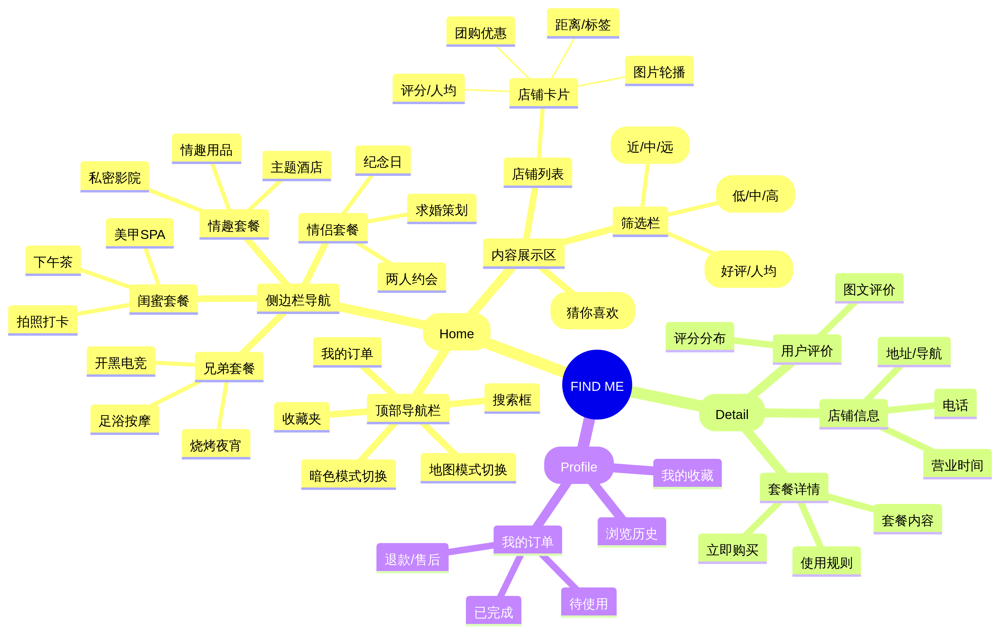
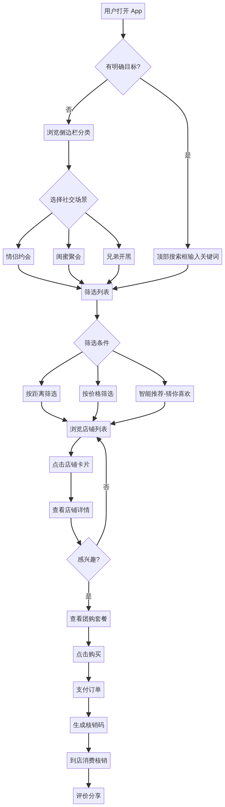

# FIND ME 原型结构与交互流程图

**版本号**: 1.0  
**日期**: 2026-01-20  
**作者**: Manus AI

---

## 1. 概述 (Overview)
本文档旨在通过可视化的结构图和流程图，清晰展示 **FIND ME** 平台的信息架构、用户操作路径以及核心页面的布局逻辑。配合高保真代码原型，帮助开发团队和设计团队统一对产品逻辑的理解。

---

## 2. 信息架构 (Information Architecture)
下图展示了 FIND ME 平台的功能结构层级，从首页导航到深层的内容详情，确保用户在任何层级都能快速定位。

### 架构说明
*   **扁平化层级**: 核心功能（筛选、浏览、详情）均控制在 3 层以内，减少用户点击次数。
*   **场景化分类**: 侧边栏作为一级导航，直接以“社交场景”切入，而非传统的“餐饮/娱乐”分类。
*   **双重浏览模式**: 支持“列表模式”高效比价和“地图模式”空间探索，满足不同场景需求。

---

## 3. 核心交互流程 (User Flow)
下图展示了用户从打开 App 到完成消费核销的完整路径，涵盖了搜索、筛选、决策和支付闭环。

### 关键路径分析
1.  **场景选择**: 用户进入 App 后，首先通过侧边栏选择社交场景（如“情侣约会”），系统自动过滤不相关内容。
2.  **智能筛选**: 用户通过顶部的“价格”、“距离”筛选器进一步缩小范围，或直接点击“猜你喜欢”查看推荐。
3.  **决策转化**: 点击店铺卡片查看详情，确认套餐内容后下单支付，生成核销码完成闭环。

---

## 4. 页面布局线框 (Wireframe Schematics)

### 4.1 首页布局 (Home Layout)
首页采用 **左侧固定导航 + 右侧流式内容** 的经典布局（桌面端），移动端自动切换为 **顶部导航 + 抽屉菜单**。

| 区域 | 组件 | 交互逻辑 |
| :--- | :--- | :--- |
| **顶部栏** | Logo, 搜索框, 功能图标 | 搜索框支持实时过滤；功能图标（暗色模式、订单、收藏）提供快捷入口。 |
| **侧边栏** | 一级分类, 二级子菜单 | **一级分类**: 点击展开/收起；**二级菜单**: 首项胶囊样式，点击刷新右侧列表。 |
| **内容区** | 筛选栏, 推荐位, 店铺列表 | **筛选栏**: 吸顶展示；**推荐位**: 横向滚动；**列表**: 瀑布流或单列大图展示。 |

### 4.2 详情页交互 (Detail Interaction)
详情页采用 **右侧抽屉 (Drawer) / 弹窗 (Modal)** 形式，保证用户不离开当前列表上下文。

*   **头部**: 高清轮播图，支持手势滑动。
*   **信息区**: 店名、评分、人均、地址（点击导航）、电话。
*   **套餐区**: 核心团购套餐列表，突出“抢购”按钮。
*   **评价区**: 用户真实评价摘要，支持查看更多。

---

## 5. 交互细节说明 (Interaction Details)

### 5.1 侧边栏微交互
*   **Hover 效果**: 鼠标悬停在一级菜单上时，背景色轻微变深，提示可点击。
*   **展开动画**: 二级菜单展开时，使用 `ease-in-out` 缓动函数，时长 300ms，避免生硬的跳变。
*   **胶囊状态**: 选中二级菜单时，胶囊背景色从浅橙色平滑过渡到品牌橙色 (#FF5500)。

### 5.2 移动端适配
*   **汉堡菜单**: 在屏幕宽度小于 768px 时，侧边栏自动隐藏，顶部左侧显示汉堡菜单图标。
*   **抽屉导航**: 点击汉堡菜单，侧边栏以抽屉形式从左侧滑出，遮罩层覆盖背景，点击遮罩层可关闭菜单。
